# CollabSpace — Real-Time Collaborative Workspace

### A Unified Platform for Document Editing, Project Management & Team Communication

---

## 1. Introduction

**CollabSpace** is a full-stack real-time collaborative workspace that consolidates document editing, Kanban-based task management, and team communication into a single platform. It solves the core problem of **tool fragmentation** — where teams juggle between Google Docs, Trello, Slack, and other apps — by providing one unified, self-hosted workspace.

> **Key Principle:** One workspace. One login. Complete collaboration.

---

## 2. Problem Statement

Modern teams face critical challenges with fragmented collaboration tools:

| Problem | Impact |
|---|---|
| Multiple apps for docs, tasks, chat | Constant context switching |
| Complex access management | Security vulnerabilities |
| High subscription costs | Budget strain for small teams |
| Poor integration between tools | Information silos |

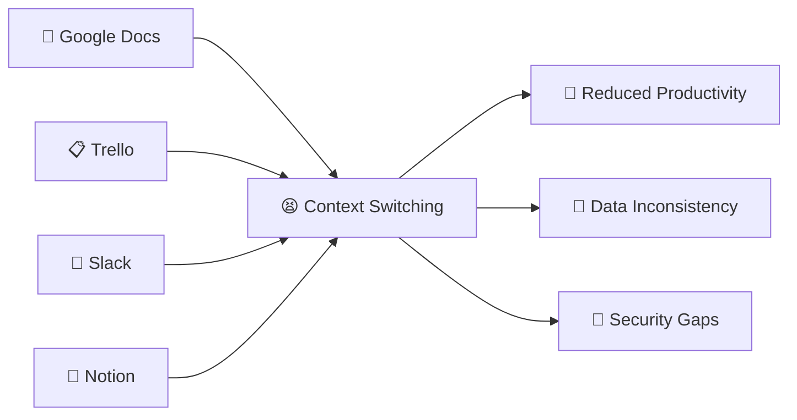

---

## 3. Proposed Solution

CollabSpace provides an **all-in-one collaborative workspace** with these core modules:

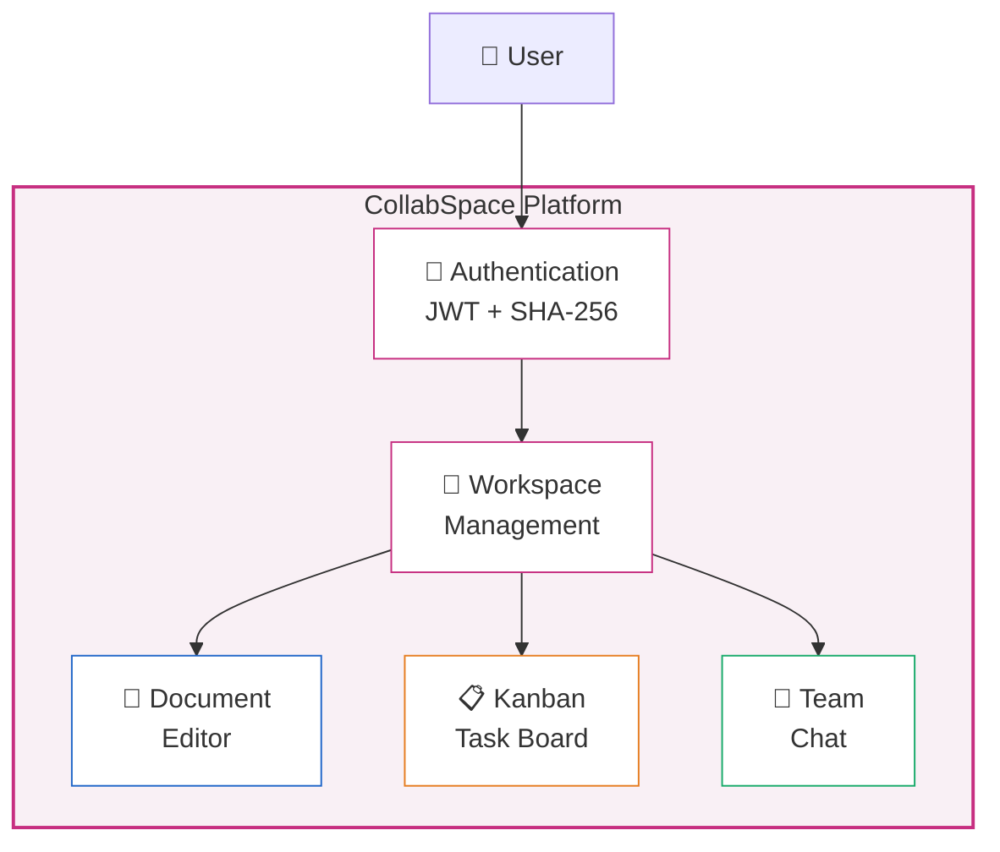

### Feature Summary

| Module | Capabilities | Status |
|---|---|---|
| **Authentication** | Register, Login, JWT tokens, Session persistence | ✅ Complete |
| **Workspaces** | Create, Select, Delete, Multi-workspace support | ✅ Complete |
| **Documents** | Create, Edit, Auto-save (2s debounce), Delete | ✅ Complete |
| **Task Board** | Kanban (To Do / In Progress / Done), Status transitions, Delete | ✅ Complete |
| **Team Chat** | Real-time messaging, User name resolution, Auto-scroll | ✅ Complete |

---

## 4. System Architecture

### 4.1 High-Level Architecture

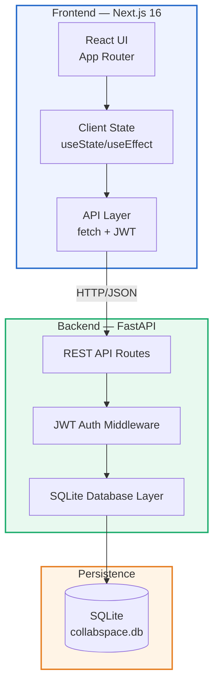

### 4.2 Technology Stack

| Layer | Technology | Purpose |
|---|---|---|
| **Frontend** | Next.js 16 (React 19) | Server-side rendering, App Router |
| **Styling** | Vanilla CSS | Custom design system, no framework overhead |
| **Typography** | Inter + JetBrains Mono | Modern UI & code fonts via Google Fonts |
| **Backend** | FastAPI (Python) | High-performance async REST API |
| **Database** | SQLite | Zero-config, file-based persistence |
| **Auth** | JWT (PyJWT) + SHA-256 | Stateless token authentication |
| **Container** | Docker Compose | Multi-service orchestration |

---

## 5. Database Schema

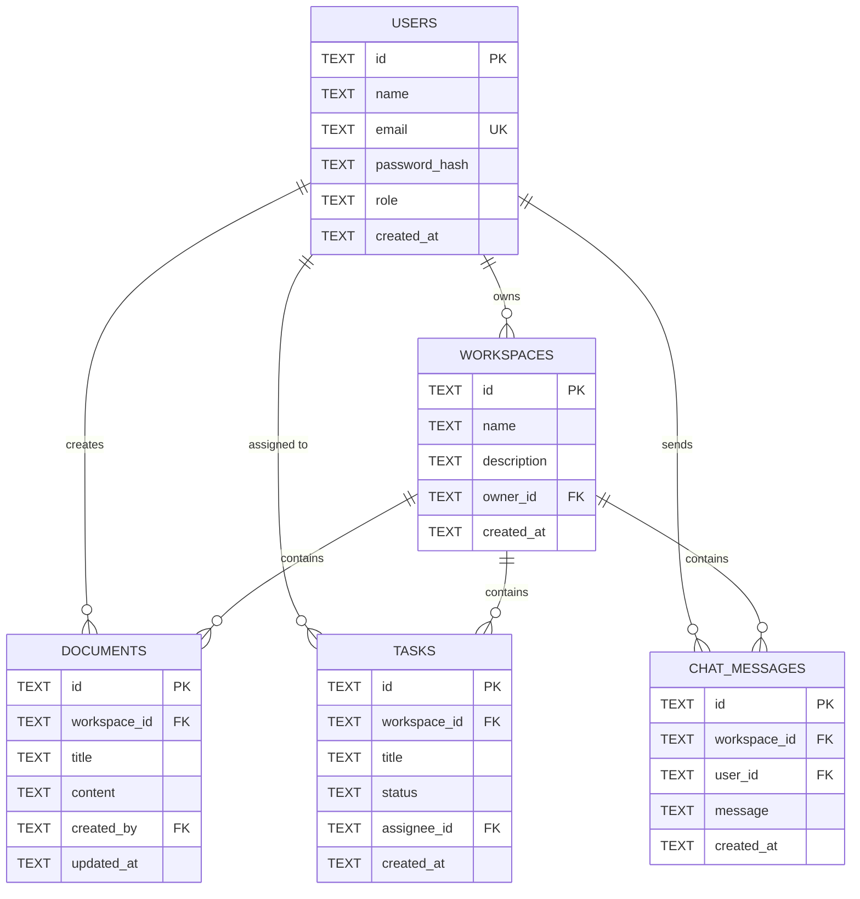

---

## 6. API Endpoints

### 6.1 Route Map

| Method | Endpoint | Description | Auth |
|---|---|---|---|
| `POST` | `/api/auth/register` | Register new user | ❌ |
| `POST` | `/api/auth/login` | Login & get JWT | ❌ |
| `GET` | `/api/me` | Current user profile | ✅ |
| `POST` | `/api/users/names` | Batch user name lookup | ✅ |
| `GET` | `/api/workspaces` | List user's workspaces | ✅ |
| `POST` | `/api/workspaces` | Create workspace | ✅ |
| `DELETE` | `/api/workspaces/:id` | Delete workspace | ✅ |
| `GET` | `/api/documents/:wsId` | List workspace documents | ✅ |
| `POST` | `/api/documents` | Create document | ✅ |
| `PATCH` | `/api/documents/item/:id` | Update document content | ✅ |
| `DELETE` | `/api/documents/item/:id` | Delete document | ✅ |
| `GET` | `/api/tasks/:wsId` | List workspace tasks | ✅ |
| `POST` | `/api/tasks` | Create task | ✅ |
| `PATCH` | `/api/tasks/:id` | Update task status | ✅ |
| `DELETE` | `/api/tasks/:id` | Delete task | ✅ |
| `GET` | `/api/chat/:wsId` | Get chat messages | ✅ |
| `POST` | `/api/chat` | Send chat message | ✅ |

### 6.2 Request Flow

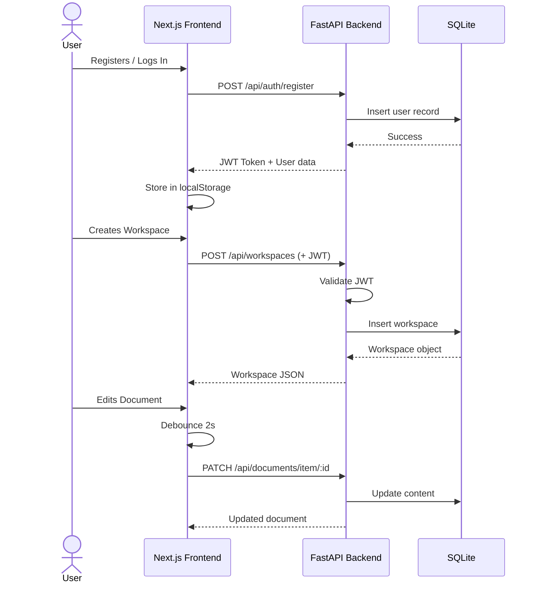

---

## 7. Frontend Architecture

### 7.1 Page-Based Navigation

The frontend uses a **single-page app** with client-side navigation between four dedicated views:

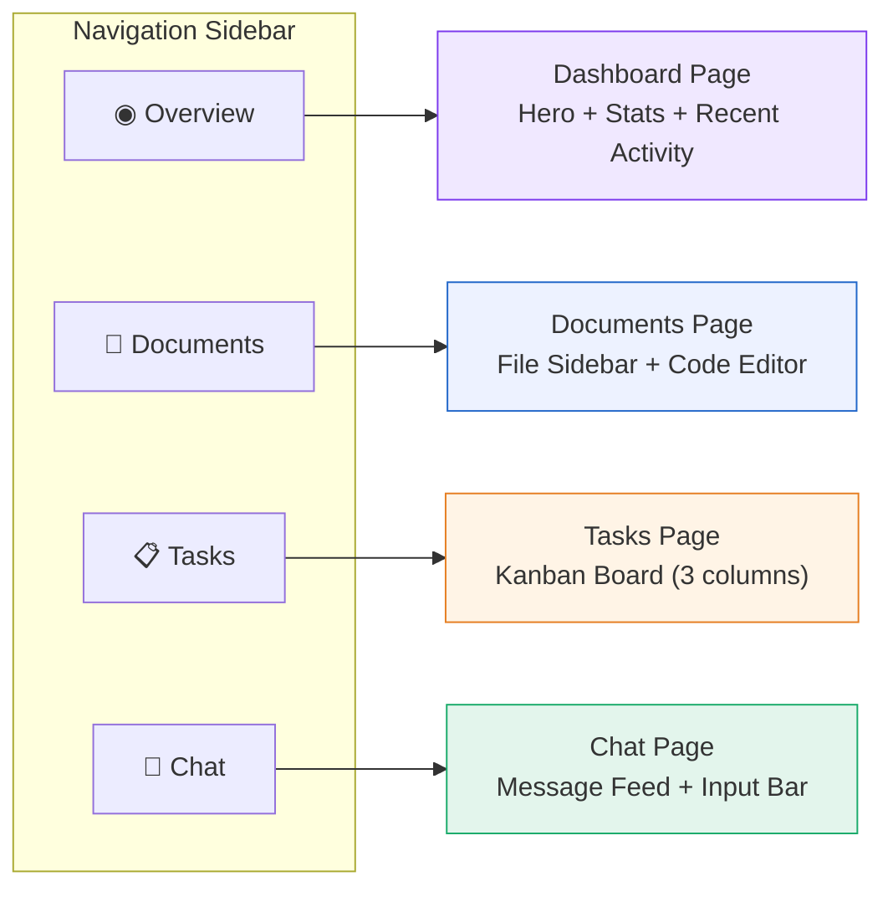

### 7.2 UI Design System

The UI follows a **clean, light theme** inspired by modern dashboard design:

| Token | Value | Usage |
|---|---|---|
| Background | `#f2f4f8` | Page background |
| Card | `#ffffff` | All content cards |
| Accent | `#c72f81` | Buttons, active states, links |
| Text | `#20232a` | Primary text |
| Muted | `#8b96a8` | Secondary text |
| Radius | `14px` | Card corners |
| Font | Inter | UI typography |
| Code Font | JetBrains Mono | Document editor |

### 7.3 Component Tree

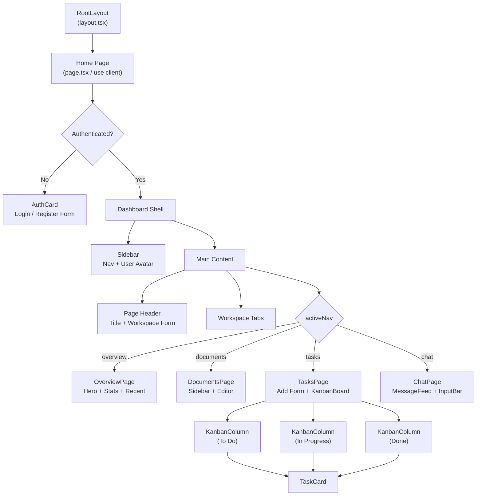

---

## 8. Key Features In Detail

### 8.1 Authentication System
- JWT-based stateless authentication with 7-day expiry
- SHA-256 password hashing
- Persistent sessions via `localStorage`
- Hydration-safe loading (server/client mismatch prevention)

### 8.2 Document Editor
- Multi-document sidebar with quick switching
- Auto-save with **2-second debounce** — no manual save needed
- Visual save indicator (Idle → Saving → Saved)
- JetBrains Mono monospace font for code-like editing
- Create and delete documents per workspace

### 8.3 Kanban Task Board
- **Three-column layout**: To Do (violet) → In Progress (orange) → Done (green)
- Color-coded column headers with count badges
- Inline status dropdown for drag-free transitions
- Task creation form with quick-add
- Delete button per task

### 8.4 Team Chat
- Workspace-scoped messaging
- User name resolution via batch API
- Chat bubble styling (self vs. others)
- Auto-scroll to latest message
- Timestamp display for each message

---

## 9. Project Structure

```
CollabSpace/
├── fastapi_backend/           # Python Backend
│   ├── main.py                # All API routes + DB init
│   ├── collabspace.db         # SQLite database (auto-created)
│   └── requirements.txt       # Python dependencies
│
├── nextjs-frontend/           # React Frontend
│   ├── src/app/
│   │   ├── layout.tsx         # Root layout + fonts
│   │   ├── page.tsx           # Main SPA (~970 lines)
│   │   └── globals.css        # Complete design system
│   ├── package.json
│   └── postcss.config.mjs
│
├── docker-compose.yml         # Container orchestration
├── discribtion.md             # Project description
└── presentation.md            # This file
```

---

## 10. How to Run

### Prerequisites
- Python 3.10+
- Node.js 18+

### Backend
```bash
cd fastapi_backend
pip install fastapi uvicorn pyjwt
python -m uvicorn main:app --reload --port 8000
```

### Frontend
```bash
cd nextjs-frontend
npm install
npm run dev
# Opens at http://localhost:3000
```

### Docker (Production)
```bash
docker-compose up --build
# Backend: http://localhost:8000
# Frontend: http://localhost:3000
```

---

## 11. Data Flow Diagram (DFD)

### Level 0 — Context Diagram

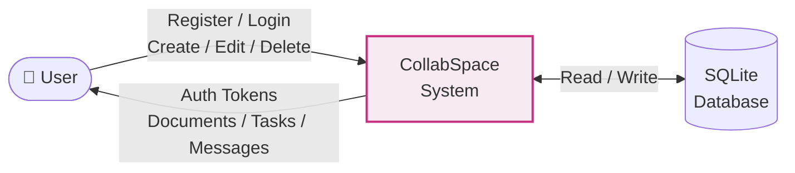

### Level 1 — Functional Decomposition

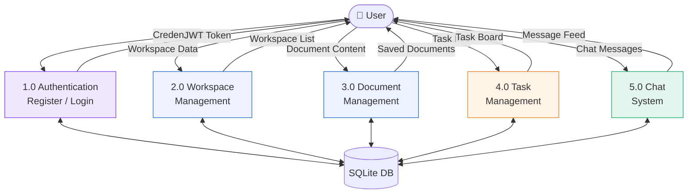

---

## 12. Current Status

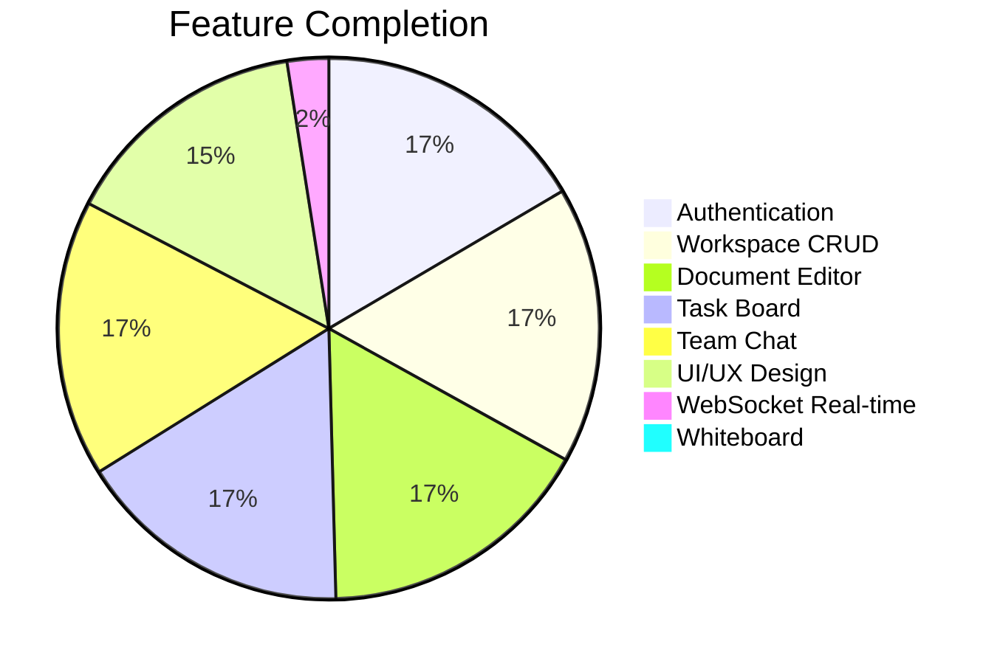

### What's Done (v1.0)

| # | Feature | Status |
|---|---|---|
| 1 | User Registration & Login | ✅ |
| 2 | JWT Authentication & Session | ✅ |
| 3 | Workspace CRUD + multi-workspace | ✅ |
| 4 | Document Create / Edit / Delete | ✅ |
| 5 | Auto-save with debounce | ✅ |
| 6 | Kanban Board (3 columns) | ✅ |
| 7 | Task status transitions | ✅ |
| 8 | Team Chat messaging | ✅ |
| 9 | User name resolution | ✅ |
| 10 | Toast notifications | ✅ |
| 11 | Responsive design | ✅ |
| 12 | Page-based navigation | ✅ |
| 13 | Clean light theme UI | ✅ |
| 14 | Docker deployment config | ✅ |

---

## 13. Future Scope & Roadmap

### Phase 2 — Real-Time Enhancement

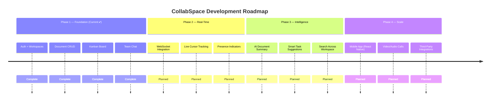

### Detailed Future Plans

| Priority | Feature | Description | Technology |
|---|---|---|---|
| 🔴 High | **WebSocket Real-Time Sync** | Live collaborative editing, presence indicators, typing status | Socket.IO / WebSockets |
| 🔴 High | **CRDT / OT Conflict Resolution** | Multiple users editing the same document simultaneously | Yjs / Automerge |
| 🟡 Medium | **File Attachments** | Upload images, PDFs, and files to documents and chat | S3 / MinIO |
| 🟡 Medium | **Whiteboard Module** | Collaborative drawing canvas with shapes and sticky notes | Canvas API / Excalidraw |
| 🟡 Medium | **AI Features** | Document summarization, auto-tagging, smart suggestions | OpenAI API / LLM |
| 🟡 Medium | **Search** | Full-text search across documents, tasks, and messages | SQLite FTS5 |
| 🟢 Low | **Mobile App** | Native iOS/Android app for on-the-go collaboration | React Native / Flutter |
| 🟢 Low | **Video/Audio Calls** | Built-in video conferencing within workspaces | WebRTC |
| 🟢 Low | **Third-Party Integrations** | GitHub, Google Drive, Calendar sync | REST APIs / OAuth |
| 🟢 Low | **Advanced Analytics** | Workspace activity dashboards, productivity insights | Chart.js / D3.js |
| 🟢 Low | **Multi-Factor Auth** | TOTP-based 2FA for enhanced security | pyotp |

---

## 14. Advantages

| # | Advantage | Details |
|---|---|---|
| 1 | **Unified Platform** | Eliminates switching between Docs, Trello, Slack |
| 2 | **Zero Infrastructure** | SQLite = no database server setup required |
| 3 | **Self-Hosted** | Full data ownership, no vendor lock-in |
| 4 | **Fast Setup** | `pip install` + `npm install` → running in 30 seconds |
| 5 | **Modern UI** | Clean light theme, responsive design, smooth animations |
| 6 | **Secure** | JWT auth, hashed passwords, token expiry |
| 7 | **Extensible** | Modular architecture, easy to add new features |
| 8 | **Cost-Effective** | 100% open-source, no subscriptions |

---

## 15. Limitations

| # | Limitation | Mitigation Plan |
|---|---|---|
| 1 | No real-time multi-user sync (polling-based) | WebSocket integration in Phase 2 |
| 2 | SQLite not suitable for high concurrency | Migrate to PostgreSQL for production |
| 3 | No offline support | Service Workers + IndexedDB |
| 4 | No file upload capability | S3/MinIO integration |
| 5 | No whiteboard module yet | Canvas-based editor planned |
| 6 | Single-server deployment | Kubernetes/Docker Swarm scaling |

---

## 16. Conclusion

CollabSpace successfully delivers a **functional, unified collaboration platform** that integrates document editing, project management via Kanban boards, and team communication into a single web application. The project demonstrates practical implementation of:

- **Full-stack development** with FastAPI (Python) and Next.js (React)
- **RESTful API design** with 17 endpoints covering all CRUD operations
- **JWT-based authentication** with secure password hashing
- **Modern UI/UX** with a clean, responsive design system
- **Modular architecture** ready for real-time enhancements

The platform stands as a strong academic project with real-world applicability, and its architecture is designed to support future enhancements including real-time collaboration, AI features, and mobile applications.

---

> **CollabSpace** — *Where teams collaborate, create, and communicate — all in one place.*
